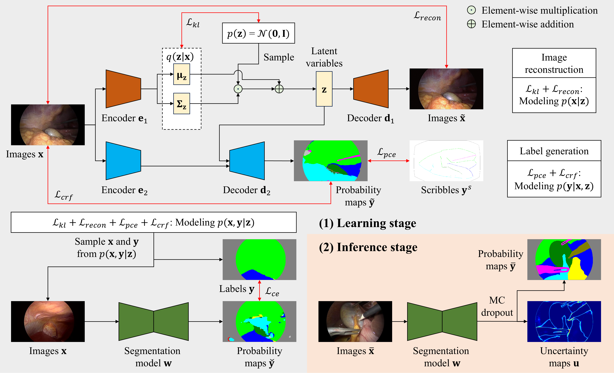

# A Bayesian Approach to Weakly-supervised Laparoscopic Image Segmentation

## Introduction
This repository provides PyTorch implementation of our MICCAI2024 paper '[A Bayesian Approach to Weakly-supervised Laparoscopic Image Segmentation](https://papers.miccai.org/miccai-2024/009-Paper0219.html)'.

<p align="center">
  
</p>

## Usage
### <li>Prepare the datasets</li>
Download the [CholecSeg8k](https://www.kaggle.com/datasets/newslab/cholecseg8k) and [AutoLaparo](https://autolaparo.github.io/) datasets.

Extract dataset files to form folder structures like 

```none
Bayesian_WSS
├── ...
├── CholecSeg8k
│   ├── ...
│   ├── dataset
│   │   ├── CholecSeg8k
│   │   │   ├── video01
│   │   │   ├── video09
│   │   │   ├── ...
│   │   ├── target_list.txt
│   │   ├── val_samples_fold_1.txt
│   │   ├── val_samples_fold_2.txt
│   │   ├── val_samples_fold_3.txt
│   │   ├── val_samples_fold_4.txt
│   │   ├── val_samples_fold_5.txt
├── AutoLaparo
│   ├── ...
│   ├── dataset
│   │   ├── AutoLaparo_Task3
│   │   │   ├── imgs
│   │   │   ├── masks
│   │   ├── target_list.txt
```

### <li>Prepare the environment</li>
Install necessary packages
```shell
pip install -r requirements.txt
```

Build extension module to apply [DenseCRF loss](https://github.com/meng-tang/rloss/tree/master/pytorch)
```shell
cd CholecSeg8k/utils/crfloss/wrapper/bilateralfilter
swig -python -c++ bilateralfilter.i
python setup.py install
```
```shell
cd AutoLaparo/utils/crfloss/wrapper/bilateralfilter
swig -python -c++ bilateralfilter.i
python setup.py install
```

### <li>Prepare weak annotations</li>
For the CholecSeg8k dataset:
```shell
cd CholecSeg8k
python weak_label_simulation.py
```

For the AutoLaparo dataset:
```shell
cd AutoLaparo
python weak_label_simulation.py
```

### <li>Train and test models</li>
With the CholecSeg8k dataset:
```shell
cd CholecSeg8k
# Default parameter values are already set.
python train.py
python inference.py
```

With the AutoLaparo dataset:
```shell
cd AutoLaparo
# Default parameter values are already set.
python train.py
python inference.py
```

## Acknowledgement
We would like to express our gratitude to the following codebases:

* [GBDL](https://github.com/Jianf-Wang/GBDL)
* [RLoss](https://github.com/meng-tang/rloss)
* [WSL4MIS](https://github.com/HiLab-git/WSL4MIS)

## Note
Contact: Zhou Zheng (zzheng@mori.m.is.nagoya-u.ac.jp)